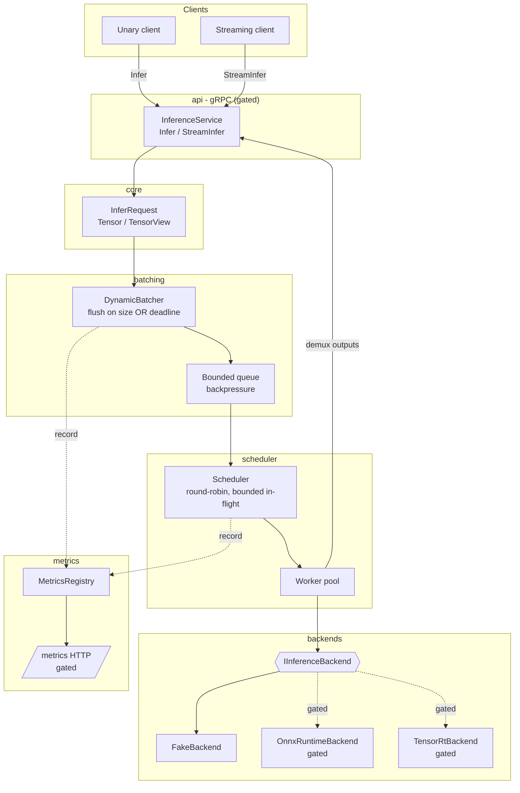

# cv-inference-server

A real-time computer-vision (CV) model serving system in modern C++20, built as a
portfolio project. It demonstrates the core building blocks of a low-latency
inference service: a pluggable backend abstraction, **dynamic request batching**
against a latency budget, **fair compute scheduling** with backpressure, an
observability surface (Prometheus metrics), and a reproducible **benchmark
harness** across compute paths.

> **What actually runs where.** The dependency-free core — value types, batching,
> scheduling, the echo backend, and metrics — builds and is fully tested on a
> **bare CPU host with nothing but CMake + a C++20 compiler**. The heavier serving
> and acceleration layers (gRPC transport, ONNX Runtime / TensorRT backends,
> Prometheus HTTP exposer, YAML/CLI config, CUDA/Vulkan benchmark paths) are
> **auto-gated**: they compile in only when their dependencies (or opt-in build
> flags) are present, and are validated separately. This README is careful to say
> which is which — see [Feature status](#feature-status).

---

## Value proposition

Serving CV models in real time is not just "call the model" — it is coalescing
bursty concurrent requests into batches without blowing a latency budget,
dispatching those batches fairly across compute so no model starves, applying
backpressure instead of growing memory unbounded, and being able to *measure* all
of it reproducibly. `cv-inference-server` implements that pipeline as clean,
independently testable C++20 modules, with a design that degrades gracefully from
a GPU host all the way down to a CPU-only laptop.

---

## Feature status

The project is a **CPU vertical slice** of a larger design. Capabilities fall into
three honest buckets:

### ✅ Works on CPU-only / exercised in CI

| Capability | Notes |
|---|---|
| Core value types (`Tensor`, `TensorView`, `DataType`, `Shape`, `InferRequest`, `InferResponse`, `Status`, `Expected`) | RAII, move-only tensors; no I/O, no GPU. |
| `IInferenceBackend` abstraction + `FakeBackend` (echo) | Backend factory with graceful "unknown/unavailable backend" failures. |
| `DynamicBatcher` | Coalesce by model; flush on **max batch size OR max-wait deadline**; correct demux by correlation id; disable path (batch-of-one); bounded queue → `RESOURCE_EXHAUSTED` backpressure. |
| `Scheduler` | Round-robin fairness (no starvation), bounded in-flight batches, error propagation. |
| `MetricsRegistry` | Counters / gauges / histograms; Prometheus **text exposition** rendering. |
| `cvis-bench` CPU path | Batch × concurrency sweep, p50/p99/mean/max + throughput, JSON + CSV with hardware/reproducibility metadata. |
| `cvis-server` core pipeline | Boots the batcher/scheduler/registry and holds ready models even when the gRPC transport is not compiled. |
| 34 GoogleTest unit tests, ASan + TSan clean | Sanitizer matrix runs in CI. |

### ⚙️ Present but GPU-only / flag-gated / manually validated

These are compiled and wired into the design but are **OFF by default** and
validated only on appropriate hardware — not in CPU CI.

| Capability | Gate | Validation |
|---|---|---|
| gRPC transport (`cvis_api`: unary `Infer` + streaming `StreamInfer`, health/readiness) | Auto-`CVIS_ENABLE_GRPC` (needs protobuf + gRPC) | Manual, when deps present |
| ONNX Runtime backend (CPU EP always; CUDA EP under CUDA) | Auto-`CVIS_ENABLE_ONNXRUNTIME`; `CVIS_ENABLE_CUDA` | Manual / GPU host |
| TensorRT backend (ONNX→TRT + engine cache) | `CVIS_ENABLE_TENSORRT` (implies CUDA) | GPU host only |
| Prometheus **HTTP** `/metrics` exposer | Auto-`CVIS_ENABLE_METRICS_HTTP` (needs prometheus-cpp) | Manual, when deps present |
| Full YAML config + CLI11 overrides | Auto-`CVIS_ENABLE_CONFIG_YAML` (needs yaml-cpp + CLI11) | Manual, when deps present |
| `cvis-bench` CUDA / Vulkan cells | `CVIS_ENABLE_CUDA` / `CVIS_ENABLE_VULKAN_BENCH` | GPU host; cells report `unavailable` otherwise |

> On a bare CPU host, `cvis-server` prints that the gRPC transport is not compiled
> and keeps the core pipeline (batcher + scheduler + model registry) up. A minimal
> built-in argv scan still provides a default `echo`/`fake` model so the process
> runs end-to-end without any config dependency.

### 🚧 Deferred (designed, not implemented in this slice)

| Capability | Reference |
|---|---|
| Runtime model **load/unload** management RPCs (`LoadModel`/`UnloadModel`) | FR-5 / OQ-6 — startup-time loading is the v1 requirement; management methods exist in the proto contract but may return `UNIMPLEMENTED`. |
| GPU CI (automated CUDA/TensorRT build+bench) | R-1 — requires GPU runners. |
| Vulkan benchmark compute path | OQ-1 / R-5 — best-effort, benchmark-only, currently a gated stub. |
| Empirical latency NFR baselining on GPU | NFR-1 / OQ-2 — numbers to be filled in on hardware. |

---

## Architecture

Layered C++20 modules with **unidirectional** dependencies (upper layers depend on
lower; `core` depends on nothing project-internal), which is what keeps `core`,
`batching`, `scheduler`, and `backends` independently unit-testable on a CPU-only
machine.

| Module (library) | Responsibility |
|---|---|
| `cvis_core` | Value types: tensors, shapes, dtypes, request/response, `Status`/`Expected`. No I/O, no gRPC, no CUDA. |
| `cvis_backends` | `IInferenceBackend` + `FakeBackend` (always); `OnnxRuntimeBackend` / `TensorRtBackend` (gated). Factory-constructed. |
| `cvis_batching` | `DynamicBatcher`: coalesce by model, flush on size or deadline, demux, disable path, bounded-queue backpressure. |
| `cvis_scheduler` | `Scheduler`: round-robin fair dispatch, bounded in-flight batches, worker pool. |
| `cvis_metrics` | `MetricsRegistry` + Prometheus text rendering + (gated) HTTP exposer. |
| `cvis_api` | gRPC transport: unary + streaming inference, health/readiness. *(gated)* |
| `cvis_runtime` | Composition root: `Config` loader, `ModelRegistry`, `ServerApp` lifecycle. |
| `cvis-server` (exe) | Thin `main()` wiring `cvis_runtime`. |
| `cvis-bench` (exe) | Benchmark harness over `backends` (does not depend on `api`). |

### Request lifecycle



The full design (with interface signatures, concurrency model, and rationale) is in
[docs/design/architecture.md](docs/design/architecture.md) and
[docs/design/interfaces.md](docs/design/interfaces.md); requirements are in
[docs/requirements/SRS.md](docs/requirements/SRS.md).

---

## Build (CPU-only default)

Requires CMake ≥ 3.24 and a C++20 compiler (GCC/Clang). GoogleTest is fetched
automatically via `FetchContent`; **no package manager or GPU is needed** for the
default build.

```bash
cmake -S . -B build -DCMAKE_BUILD_TYPE=Release
cmake --build build -j
ctest --test-dir build --output-on-failure
```

All heavy dependencies auto-gate OFF when absent, so this produces a green build
and a passing test suite on a bare CPU host.

### Build options

All GPU/Vulkan options default **OFF**; the dependency-detected options turn ON
only when their libraries are found (and hard-fail if you force them ON without the
dependency).

| Option | Default | Effect |
|---|---|---|
| `CVIS_ENABLE_CUDA` | OFF | ONNX Runtime CUDA execution provider path (requires CUDA ORT + GPU at runtime). |
| `CVIS_ENABLE_TENSORRT` | OFF | Build `TensorRtBackend` (ONNX→TRT + engine cache). **Implies** `CVIS_ENABLE_CUDA`. |
| `CVIS_ENABLE_VULKAN_BENCH` | OFF | Build the Vulkan **benchmark-only** compute path. Never affects serving. |
| `CVIS_ENABLE_SANITIZERS` | OFF | Enable ASan/UBSan or TSan (see [Testing](#testing--sanitizers)). |
| `CVIS_SANITIZER` | `address` | Sanitizer to use when enabled: `address` \| `thread`. |
| `CVIS_BUILD_TESTS` | ON | Build unit tests and register them with CTest. |
| `CVIS_BUILD_BENCH` | ON | Build the `cvis-bench` harness. |
| `CVIS_ENABLE_GRPC` | auto | gRPC transport; ON iff protobuf + gRPC are found. |
| `CVIS_ENABLE_ONNXRUNTIME` | auto | ONNX Runtime backend; ON iff `onnxruntime` is found. |
| `CVIS_ENABLE_METRICS_HTTP` | auto | `/metrics` HTTP exposer; ON iff prometheus-cpp is found. |
| `CVIS_ENABLE_CONFIG_YAML` | auto | Full YAML + CLI config; ON iff yaml-cpp + CLI11 are found. |

The CMake configure step prints a summary of which layers are enabled.

---

## Running

### Server

```bash
./build/bin/cvis-server
```

On a CPU-only build the server boots the core pipeline with a default `echo`
(`fake`) model, reports that the gRPC transport is not compiled, and (if the
prometheus-cpp HTTP exposer was built) serves `/metrics`. With the config layer
compiled in, `-c/--config <file.yaml>` plus `--grpc-bind` / `--metrics-bind` /
`--metrics-port` overrides are available. Shutdown is graceful on `SIGINT`/`SIGTERM`.

### Benchmark

`cvis-bench` drives `IInferenceBackend` directly (bypassing gRPC) so it measures
compute, not transport. It sweeps a batch × concurrency grid, reports
p50/p99/mean/max latency and throughput, and prints JSON to stdout — optionally
writing JSON and CSV files with hardware/reproducibility metadata.

```bash
./build/bin/cvis-bench \
  --batch 1,4,8 \
  --concurrency 1,2,4 \
  --iterations 200 \
  --warmup 20 \
  --out results.json \
  --csv results.csv
```

The CPU path always runs. `cuda` and `vulkan` cells are emitted but marked
`"available": false` unless built with the corresponding flag **and** run on GPU
hardware.

---

## Testing & sanitizers

34 GoogleTest unit tests cover the core types, fake backend, backend factory,
metrics, scheduler, and dynamic batcher.

```bash
# Default CPU test run
ctest --test-dir build --output-on-failure

# ThreadSanitizer
cmake -S . -B build-tsan -DCMAKE_BUILD_TYPE=Debug \
  -DCVIS_ENABLE_SANITIZERS=ON -DCVIS_SANITIZER=thread
cmake --build build-tsan -j
setarch "$(uname -m)" -R ctest --test-dir build-tsan --output-on-failure

# AddressSanitizer + UBSan
cmake -S . -B build-asan -DCMAKE_BUILD_TYPE=Debug \
  -DCVIS_ENABLE_SANITIZERS=ON -DCVIS_SANITIZER=address
cmake --build build-asan -j
setarch "$(uname -m)" -R ctest --test-dir build-asan --output-on-failure
```

> `setarch -R` disables ASLR for sanitizer runs; combined with
> `gtest_discover_tests(... DISCOVERY_MODE PRE_TEST)` this keeps the sanitizer jobs
> reproducible on high-entropy kernels (see the CHANGELOG D-1 note).

CI runs the CPU Release build + test suite and the ASan/TSan matrix on both GitHub
Actions and GitLab CI. Tagged releases build, test, package a CPack TGZ, and
attach it to the GitHub Release.

---

## License

Released under the [MIT License](LICENSE).
