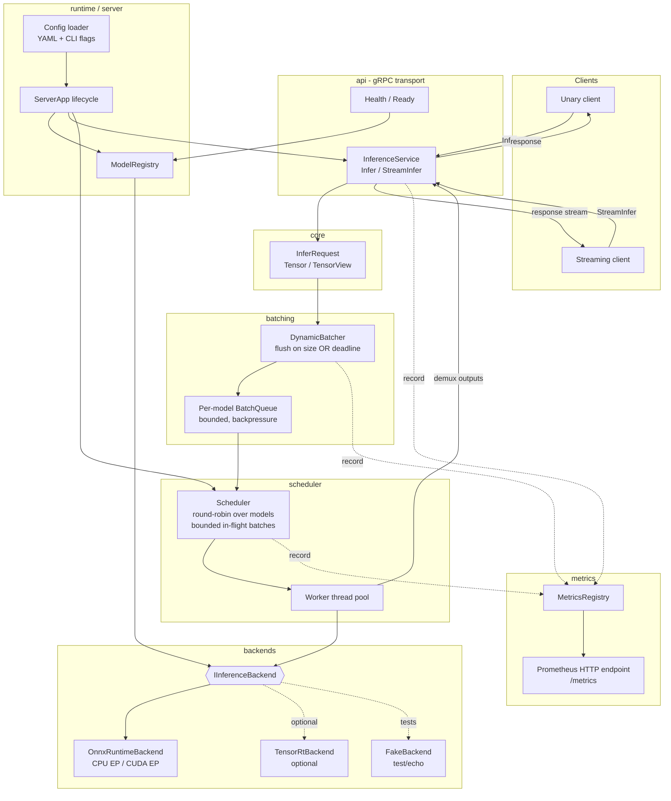

# Design Specification — CV Inference Server Architecture

- **Project:** `cv-inference-server`
- **Document type:** Design Document Specification (DDS)
- **Traces to:** `docs/requirements/SRS.md` (FR-1..FR-31, NFR-1..NFR-13)
- **Author role:** System Architect
- **Status:** Draft v0.1
- **Companion doc:** [interfaces.md](interfaces.md) (C++ interface signatures)

---

## 0. Scoping decisions (resolve SRS Open Questions)

These PM/stakeholder decisions are treated as binding inputs and close the SRS open questions:

| SRS OQ | Decision adopted by this design |
|--------|---------------------------------|
| **OQ-1** (Vulkan) | ONNX Runtime is the **primary** backend: CPU Execution Provider (EP) always available, CUDA EP when a GPU is present. TensorRT is an **optional** CUDA backend. Vulkan is a **best-effort, benchmark-only compute path** gated behind a CMake flag (`CVIS_ENABLE_VULKAN_BENCH`), **not** a serving backend. Everything degrades to a CPU-only build/run. |
| **OQ-2** | Reference model = a standard ONNX CV classifier (e.g. ResNet-50). Latency NFRs (NFR-1) are **empirically baselined**, not hard CI gates. |
| **OQ-3** | Formats: ONNX for ONNX Runtime; ONNX→TensorRT converted **on-the-fly** with an on-disk **engine cache** for TensorRT. |
| **OQ-4** | Metrics exposed in **Prometheus text exposition format** over an HTTP endpoint. |
| **OQ-5** | Configuration via a **config file** (YAML — justified in §5.3) with **command-line flag overrides**. |
| **OQ-6** | **Startup-time** model loading is the v1 requirement. Runtime load/unload (FR-5, FR-1 management path) is **deferred/optional** behind a management gRPC method stubbed but not required for v1. |

**Prioritization:** ONNX Runtime **CPU serving path is the first vertical slice**. GPU/CUDA, TensorRT, dynamic-batching tuning, and the Vulkan benchmark path layer on afterwards (see §11 Phased Plan).

---

## 1. Architecture Overview

The server is a single Linux process composed of layered modules with unidirectional
dependencies (upper layers depend on lower layers; lower layers never depend on
upper ones). The gRPC transport layer converts protobuf messages into internal
`core` value types, hands them to the `batching` layer, which coalesces them and
submits batched work to the `scheduler`, which dispatches to a concrete
`IInferenceBackend`. Results flow back along a completion channel (per-request
`std::promise`/future) so the transport layer can respond without knowing anything
about batching or backends.

### 1.1 Data flow (request lifecycle)



### 1.2 Layer dependency rule

`api` → `core`, `batching`, `metrics`
`batching` → `core`, `scheduler` (submits work), `metrics`
`scheduler` → `core`, `backends`, `metrics`
`backends` → `core`
`runtime/server` → everything (composition root)
`bench` → `core`, `backends`, `metrics` (does **not** depend on `api`)

`core` depends on nothing project-internal. This keeps `core` and `backends`
independently unit-testable on a CPU-only machine.

---

## 2. Module Breakdown

| Module (library target) | Responsibility | Depends on | GPU-optional? |
|---|---|---|---|
| `cvis_core` | Value types: `Tensor`, `TensorView`, `DataType`, `Shape`, `InferRequest`, `InferResponse`, `Status`/error type, correlation id. No I/O, no gRPC, no CUDA. | (none) | No |
| `cvis_backends` | `IInferenceBackend` abstraction + `OnnxRuntimeBackend` (always built), `TensorRtBackend` (optional), `FakeBackend` (test/echo). Model load, warmup, execute-batch. | `cvis_core`, ONNX Runtime | Impl-conditional |
| `cvis_batching` | `DynamicBatcher` + per-model bounded `BatchQueue`. Coalesce by model, flush on max-batch-size OR max-wait deadline, demux. | `cvis_core`, `cvis_scheduler`, `cvis_metrics` | No |
| `cvis_scheduler` | `Scheduler`: fair (no-starvation) dispatch of batched work to a backend via a worker pool; bounds in-flight batches (backpressure). | `cvis_core`, `cvis_backends`, `cvis_metrics` | No |
| `cvis_metrics` | `MetricsRegistry` wrapping prometheus-cpp; counters/histograms/gauges; HTTP `/metrics` exposer. | `cvis_core`, prometheus-cpp | No |
| `cvis_api` | Generated protobuf/gRPC stubs + `InferenceServiceImpl` (unary + streaming), health/readiness service. Marshals proto ↔ `core`. | `cvis_core`, `cvis_batching`, `cvis_metrics`, gRPC | No |
| `cvis_runtime` | Composition root: `Config` loader (YAML + CLI), `ModelRegistry`, `ServerApp` lifecycle (startup model load, graceful shutdown). | all of the above | No |
| `cvis_bench` (exe) | Benchmark harness: sweeps batch/concurrency, measures p50/p99 + throughput, emits JSON/CSV, drives CPU/CUDA/Vulkan paths directly against `backends`. | `cvis_core`, `cvis_backends`, `cvis_metrics` | Path-conditional |
| `cvis_server` (exe) | Thin `main()` that wires `cvis_runtime` and runs the server. | `cvis_runtime` | No |

**Justification for split:** `batching` and `scheduler` are separated because they
have different concurrency roles — batching is a *time/size accumulation* concern,
scheduling is a *fairness/dispatch/backpressure* concern. Keeping them apart lets
each be unit-tested against a `FakeBackend` without the other (FR-8, NFR-10).
`metrics` is a leaf-ish cross-cutting library injected by reference so no module
hard-couples to prometheus-cpp except through `MetricsRegistry`.

---

## 3. Key Interfaces (summary)

Full C++ signatures with ownership and thread-safety annotations are in
[interfaces.md](interfaces.md). Summary of the core abstractions:

- **`cvis::core::Tensor`** — owns a contiguous byte buffer + `DataType` + `Shape`.
  Move-only, value type, RAII. `TensorView` is a non-owning read-only span.
- **`cvis::backends::IInferenceBackend`** — pure abstract:
  `load()`, `metadata()`, `executeBatch(std::span<const InferRequest*>) ->
  std::vector<InferResponse>`. Backends are constructed via a factory keyed by
  backend name; ownership held as `std::unique_ptr` by the `ModelRegistry`.
- **`cvis::batching::DynamicBatcher`** — thread-safe submit; internal timer/worker
  flushes batches to the `Scheduler`. Returns a `std::future<InferResponse>` per
  submitted request.
- **`cvis::scheduler::Scheduler`** — owns worker thread(s); fair pop across
  per-model queues; bounded in-flight batches for backpressure.
- **`cvis::runtime::Config`** — plain struct populated from YAML + CLI overrides.

Error handling strategy: **`std::expected<T, Status>`** (C++23 where available,
otherwise a vendored `tl::expected`) for all fallible library boundaries; **no
exceptions across module boundaries** except from `main`/startup where they are
caught and mapped to a non-zero exit (NFR-13). gRPC handlers convert `Status` into
`grpc::Status`. Rationale in §9.

---

## 4. gRPC / Proto Contract

Package `cvis.v1`. The contract is stable and backend-agnostic (NFR-12): adding a
backend or compute path never changes it.

```proto
syntax = "proto3";
package cvis.v1;

enum DataType {
  DT_UNSPECIFIED = 0;
  DT_FLOAT32 = 1;
  DT_FLOAT16 = 2;
  DT_INT8    = 3;
  DT_UINT8   = 4;
  DT_INT32   = 5;
  DT_INT64   = 6;
}

message Tensor {
  string name = 1;          // input/output binding name
  DataType dtype = 2;
  repeated int64 shape = 3; // includes batch dim only at the API edge if client batches
  bytes raw_data = 4;       // little-endian contiguous payload
}

message InferRequest {
  string model_id = 1;      // FR-4/FR-12 target model
  string correlation_id = 2;// FR-12/FR-14 echoed on response
  repeated Tensor inputs = 3;
}

message InferResponse {
  string model_id = 1;
  string correlation_id = 2;// mirrors request (FR-14)
  repeated Tensor outputs = 3;
  ErrorInfo error = 4;      // set on per-item failure in a stream; unset on success
}

message ErrorInfo {
  int32 code = 1;           // maps to canonical gRPC status codes
  string message = 2;
}

message ModelInfo {
  string model_id = 1;
  string backend = 2;       // "onnxruntime" | "tensorrt"
  bool ready = 3;
}

message ListModelsRequest {}
message ListModelsResponse { repeated ModelInfo models = 1; }

// Optional/deferred (OQ-6): runtime management. Present in contract, may return
// UNIMPLEMENTED in v1.
message LoadModelRequest  { string model_id = 1; string path = 2; string backend = 3; }
message LoadModelResponse { ModelInfo model = 1; ErrorInfo error = 2; }
message UnloadModelRequest  { string model_id = 1; }
message UnloadModelResponse { ErrorInfo error = 1; }

service InferenceService {
  rpc Infer(InferRequest) returns (InferResponse);                 // FR-10
  rpc StreamInfer(stream InferRequest) returns (stream InferResponse); // FR-11/FR-14
  rpc ListModels(ListModelsRequest) returns (ListModelsResponse);  // FR-3
  rpc LoadModel(LoadModelRequest) returns (LoadModelResponse);     // FR-5 (deferred)
  rpc UnloadModel(UnloadModelRequest) returns (UnloadModelResponse);// FR-5 (deferred)
}
```

- **Health / readiness (FR-24/FR-25):** use the standard
  `grpc.health.v1.Health` service. Liveness = server serving; Readiness =
  `ModelRegistry` has ≥1 ready model. Reuse the well-known contract rather than a
  custom one (interoperates with existing gRPC health probes).
- **Metrics (FR-26/FR-27):** **not** on gRPC. Exposed via a separate HTTP endpoint
  `GET /metrics` in Prometheus text format (OQ-4). This decouples scraping from the
  RPC data plane.
- **Malformed requests (FR-13):** shape/dtype mismatch, unknown/not-ready model →
  `INVALID_ARGUMENT` / `NOT_FOUND` / `FAILED_PRECONDITION` with a message. In
  streaming, a single bad frame yields an `InferResponse` with `error` set and the
  stream continues (correlation preserved), rather than tearing down the stream.

---

## 5. CMake Target Layout & Build Options

### 5.1 Structure

```
cv-inference-server/
├── CMakeLists.txt            # top-level: options, find_package, add_subdirectory
├── conanfile.py             # Conan 2 dependency graph (see §5.4)
├── cmake/                    # helper modules (sanitizers, warnings, options)
├── proto/                   # cvis.proto  -> generated by protobuf/grpc
├── src/
│   ├── core/     -> cvis_core        (STATIC lib)
│   ├── backends/ -> cvis_backends    (STATIC lib)
│   ├── batching/ -> cvis_batching    (STATIC lib)
│   ├── scheduler/-> cvis_scheduler   (STATIC lib)
│   ├── metrics/  -> cvis_metrics     (STATIC lib)
│   ├── api/      -> cvis_api         (STATIC lib, links generated proto target)
│   └── runtime/  -> cvis_runtime     (STATIC lib)
├── apps/
│   ├── server/   -> cvis_server      (executable)
│   └── bench/    -> cvis_bench       (executable)
└── tests/        -> cvis_tests       (CTest, GoogleTest)
```

Each module is `add_library(cvis_<name> STATIC ...)` with an
`target_include_directories(... PUBLIC include/)` so headers are consumed via the
target, and explicit `PUBLIC`/`PRIVATE` link deps to enforce the layer rule (§1.2).

### 5.2 Build options (all default `OFF` → plain CPU build works, NFR-8)

| Option | Default | Effect |
|---|---|---|
| `CVIS_ENABLE_CUDA` | OFF | Enables the ONNX Runtime **CUDA EP** path (requires CUDA-enabled ORT + GPU at runtime). |
| `CVIS_ENABLE_TENSORRT` | OFF | Builds `TensorRtBackend` (ONNX→TRT + engine cache). Implies `CVIS_ENABLE_CUDA`. |
| `CVIS_ENABLE_VULKAN_BENCH` | OFF | Builds the Vulkan **benchmark-only** compute path in `cvis_bench`. Never affects serving. |
| `CVIS_ENABLE_SANITIZERS` | OFF | ASan/LSan or TSan flags (C-7, NFR-4/NFR-5). Mutually-exclusive ASan vs TSan via a string sub-option. |
| `CVIS_BUILD_TESTS` | ON | Builds `cvis_tests` and registers CTest. |
| `CVIS_BUILD_BENCH` | ON | Builds `cvis_bench`. |

Backend compilation is guarded so `cvis_backends` always builds `OnnxRuntimeBackend`
(CPU) and `FakeBackend`; `TensorRtBackend` is compiled only under
`CVIS_ENABLE_TENSORRT`. A missing/disabled backend at runtime fails model load with
a clear reason (FR-9) — never a crash.

### 5.3 Test framework choice — **GoogleTest** (justified)

Chosen over Catch2 because: (a) GoogleMock ships with it, which we need to mock
`IInferenceBackend` for batching/scheduler tests (FR-8, NFR-10) without hand-rolling
fakes; (b) first-class Conan package (`gtest/*` → `GTest::gtest_main`,
`GTest::gmock`); (c) mature CTest integration via `gtest_discover_tests`.
Trade-off: Catch2 has a lighter single-header feel, but the built-in mocking of
GoogleMock is the deciding factor for this design's testability strategy.

### 5.4 Dependency acquisition — **Conan 2** (`find_package` only in CMake)

Third-party deps are resolved by **Conan 2** via `conanfile.py`; the root
`CMakeLists.txt` uses only `find_package()` against CMakeDeps-generated targets.
No system library paths are hard-coded.

| Dependency | ConanCenter package | CMake target | Notes / `configure()` overrides |
|---|---|---|---|
| gRPC + Protobuf | `grpc/*` | `gRPC::grpc++`, `protobuf::libprotobuf` | provides `protoc` + grpc_cpp_plugin |
| ONNX Runtime | `onnxruntime/*` | `onnxruntime::onnxruntime` | CPU EP always; set `options["onnxruntime/*"].with_cuda=True` only under `CVIS_ENABLE_CUDA` |
| spdlog | `spdlog/*` | `spdlog::spdlog` | structured logging / diagnostics (FR-2, NFR-13) |
| prometheus-cpp | `prometheus-cpp/*` | `prometheus-cpp::core`, `prometheus-cpp::pull` | `/metrics` exposer (OQ-4) |
| cpp-httplib | `httplib/*` | `httplib::httplib` | lightweight HTTP for the metrics endpoint (prometheus-cpp pull already embeds one; keep httplib only if a custom endpoint is needed) |
| yaml-cpp | `yaml-cpp/*` | `yaml-cpp::yaml-cpp` | **YAML config** (OQ-5) |
| CLI11 | `cli11/*` | `CLI11::CLI11` | command-line flag overrides (OQ-5) |
| GoogleTest | `gtest/*` | `GTest::gtest_main`, `GTest::gmock` | tests (§5.3) |
| nlohmann_json | `nlohmann_json/*` | `nlohmann_json::nlohmann_json` | machine-readable bench output (FR-30) |
| TensorRT | *system/vendor* (not on ConanCenter) | via `find_package(TensorRT)` custom module | **only** under `CVIS_ENABLE_TENSORRT`; documented as a manual prerequisite |
| Vulkan | system SDK | `find_package(Vulkan)` | **only** under `CVIS_ENABLE_VULKAN_BENCH` |

**YAML vs JSON for config (OQ-5):** YAML chosen for the human-authored server
config (comments, readability, nested per-model backend settings). JSON is reserved
for **machine** output (benchmark results, FR-30) where tooling interop matters. CLI
flags (CLI11) override any config-file value.

---

## 6. Concurrency Model

| Component | Threads | Thread-safety requirement |
|---|---|---|
| gRPC server | gRPC completion-queue thread pool (managed by gRPC) | Handlers are re-entrant; they only touch thread-safe façades (`DynamicBatcher::submit`, `MetricsRegistry`). |
| `DynamicBatcher` | 1 internal flush/timer thread per model (or a shared timer) + caller threads calling `submit` | `submit` is **thread-safe**; internal queue guarded by mutex + condition_variable. |
| `Scheduler` | N worker threads (config `scheduler.workers`, default = hardware concurrency or 1 for CPU-bound ORT) | Fair pop across per-model queues is **thread-safe**; in-flight batch counter is atomic/guarded. |
| `IInferenceBackend::executeBatch` | Called on scheduler worker threads | Implementations declare their own reentrancy. `OnnxRuntimeBackend` holds a `Ort::Session` that is thread-safe for concurrent `Run`; if not, the scheduler serializes per-model (one in-flight batch per model session). |
| `MetricsRegistry` | Any | **Thread-safe** (prometheus-cpp families are). |
| `ModelRegistry` | Startup thread + readiness reads | Built at startup; read-mostly. Guarded by `shared_mutex` to allow future runtime load (OQ-6). |

**Backpressure (FR-23, NFR-6):** each per-model `BatchQueue` is **bounded**
(`batching.max_queue_depth`). When full, `submit` returns
`RESOURCE_EXHAUSTED` (mapped to gRPC) rather than growing memory. Additionally the
`Scheduler` bounds **in-flight batches** (`scheduler.max_in_flight`); the batcher
will not flush a new batch to a model whose in-flight budget is exhausted.

**No starvation (FR-21):** the `Scheduler` selects the next per-model queue using
**round-robin** (a rotating cursor over model ids with pending work), guaranteeing
every model with pending work is eventually dispatched regardless of arrival skew.

**Data-race verification (NFR-4):** the batcher/scheduler unit tests run under a
TSan build in CI against `FakeBackend`.

---

## 7. Dynamic Batching Design

Goal (FR-15..FR-19): coalesce concurrently-arriving requests for the **same model**
into one batch, dispatch when **either** `max_batch_size` **or** `max_wait` deadline
is hit, run once, then demux outputs back to each originating request/stream.

### 7.1 Algorithm (per model)

```
submit(request):
    fut = promise.get_future()
    lock(queue.mutex)
    if queue.size() >= max_queue_depth:  return RESOURCE_EXHAUSTED   # FR-23
    if queue.empty():  queue.deadline = now() + max_wait             # start budget window
    queue.push({request, promise})
    if queue.size() >= max_batch_size:  signal(flush_now)            # size trigger FR-16
    unlock; return fut

flush_loop():                    # one timer/worker per model (or shared timer wheel)
    wait_until(queue.deadline OR flush_now OR shutdown)
    lock(queue.mutex)
    batch = drain up to max_batch_size items
    unlock
    scheduler.enqueue(model_id, batch)     # hands ownership to scheduler

on_batch_complete(batch, outputs):          # runs on scheduler worker
    for i, item in enumerate(batch):
        item.promise.set_value(demux(outputs, i))   # FR-18 correct de-batch
```

### 7.2 Batch assembly & demux

- Inputs of each request are **stacked along a new leading batch dimension** by the
  backend adapter (`stackInputs`), producing a single `[N, ...]` tensor per binding.
- After `executeBatch`, outputs `[N, ...]` are **sliced** row-wise; row `i` returns
  to request `i` with its original `correlation_id` (FR-14/FR-18).
- Requests in a batch must have **compatible per-sample shapes**; mismatched shapes
  are split into separate batches (or rejected per policy). v1 assumes fixed input
  geometry for the reference classifier (OQ-2).

### 7.3 Disable path (FR-19)

`batching.max_batch_size = 1` (or `batching.enabled = false`) makes every request
flush immediately as a batch of one — same code path, no special-casing, so batched
and unbatched results are provably identical (FR-17).

---

## 8. Benchmark Harness Design (`cvis_bench`)

Satisfies FR-28..FR-31, NFR-2, NFR-11. Runs **directly against `IInferenceBackend`**
(bypassing gRPC) so it measures compute, not transport, and so it links only
`core`/`backends`/`metrics`.

- **Metrics:** per-request latency samples → p50/p99 (and mean/max); throughput =
  completed inferences / wall time. Uses a monotonic clock; discards a warmup window.
- **Parameter sweep (FR-30):** cartesian sweep over `{batch_size} × {concurrency}`
  and over available compute paths `{cpu, cuda?, vulkan?}`. Each cell is a separate
  measured run.
- **Compute paths (OQ-1):**
  - `cpu` — ONNX Runtime CPU EP (always).
  - `cuda` — ONNX Runtime CUDA EP and/or TensorRT (only if built + GPU present).
  - `vulkan` — best-effort compute path built **only** under
    `CVIS_ENABLE_VULKAN_BENCH`; if absent, the harness **skips** that path and
    records it as `unavailable` rather than failing (NFR-8/FR-31).
- **Output (FR-30/NFR-11):** machine-readable **JSON** (nlohmann_json) and a CSV
  sidecar. Each record embeds the full run config: model id, backend, compute path,
  batch size, concurrency, and a hardware descriptor (CPU model, GPU name if any),
  so a run is reproducible (NFR-11).
- **CPU-only runnability (FR-31):** with no flags, `cvis_bench` produces the `cpu`
  path results and marks `cuda`/`vulkan` as `unavailable`.

---

## 9. Design Decisions & Trade-offs

| Decision | Chosen | Alternative | Why |
|---|---|---|---|
| Error handling at boundaries | `std::expected<T, Status>` | Exceptions everywhere | Explicit, allocation-free happy path, composes across the async batching/scheduler pipeline; exceptions reserved for startup only (NFR-13). Trade-off: more verbose call sites. |
| Config format | YAML (server) + JSON (bench output) | Single JSON, or gRPC-only management | YAML is comment-friendly for human-authored per-model config (OQ-5); JSON stays for machine interop. Trade-off: two parsers, but different audiences. |
| Batching vs scheduling split | Two modules | One combined "dispatcher" | Independent testability and clearer concurrency roles (FR-8, NFR-10). Trade-off: an extra handoff hop. |
| Backend concurrency | Serialize per-model session by default | Fully concurrent Run | ORT session thread-safety varies; per-model serialization is safe and simple. GPU throughput still comes from batching, not intra-session parallelism. Trade-off: leaves some parallelism on the table (revisit in Phase 4). |
| Metrics transport | Separate HTTP `/metrics` | gRPC metrics RPC | Prometheus scrapers expect HTTP text; decouples from data plane (OQ-4). |
| Static libs per module | `STATIC` | `SHARED` / header-only | Simplest link story for a single executable; keeps ABI concerns out of a portfolio build. |
| Test framework | GoogleTest + GoogleMock | Catch2 | Built-in mocking for `IInferenceBackend` (§5.3). |
| Vulkan | Benchmark-only, flag-gated | First-class backend | Matches OQ-1; avoids expanding the serving backend set and keeps CPU CI green. |

---

## 10. Risks

- **R-1 (from SRS) — GPU CI:** CUDA/TensorRT/Vulkan paths validated manually on GPU
  hardware; CI covers only CPU + `FakeBackend`. Mitigation: strict backend
  abstraction + fake backend so batching/scheduler logic is fully CPU-testable.
- **R-2 — Scope:** broad surface for one maintainer. Mitigation: the phased plan
  (§11) delivers a working CPU vertical slice before any GPU work.
- **R-3 — ORT session thread-safety assumptions:** if a chosen ORT build is not
  concurrent-safe, per-model serialization (§9) is the guard; confirm during Phase 1.
- **R-4 — TensorRT engine cache invalidation:** on-the-fly ONNX→TRT (OQ-3) must key
  the cache on model hash + TRT version + device; a stale cache would serve wrong
  engines. Flag for Phase 4 design detail.
- **R-5 — Vulkan feasibility:** the benchmark Vulkan path is best-effort; it may
  remain a stub if no viable compute route exists on target hardware. Acceptable per
  OQ-1 (benchmark-only, non-blocking).
- **Flagged back to Requirements Analyst:** none blocking. The SRS FR-5 (runtime
  unload) is intentionally **deferred** by OQ-6; the proto reserves the methods but
  v1 may return `UNIMPLEMENTED`. Confirm this deferral is acceptable for AC-1.

---

## 11. Phased Implementation Plan (ordered vertical slices)

Each phase is independently demonstrable and CPU-buildable up to Phase 4.

- **Phase 1 — ONNX Runtime CPU unary inference, end-to-end.**
  `core` types → `cvis.proto` + gRPC `Infer` → `OnnxRuntimeBackend` (CPU EP) →
  `ModelRegistry` startup load from YAML config. Include `FakeBackend` (echo) so the
  path is exercisable even without a real model. Unit tests for `core` +
  `FakeBackend`. **Exit:** a client gets a real inference (or echo) response on CPU.
- **Phase 2 — Streaming + dynamic batching.**
  `StreamInfer` bidi RPC with correlation; `DynamicBatcher` (size/deadline flush,
  demux) + `Scheduler` (round-robin, bounded in-flight). Batching disable path
  (batch=1). Unit tests for batcher/scheduler against `FakeBackend`, run under TSan.
  **Exit:** concurrent streamed frames batched and correctly demuxed on CPU.
- **Phase 3 — Metrics + health.**
  `MetricsRegistry` (request/error counts, latency histogram, effective batch size,
  queue depth) + Prometheus `/metrics` HTTP endpoint; gRPC health/readiness wired to
  `ModelRegistry`. **Exit:** liveness/readiness reflect real state; metrics scrapeable.
- **Phase 4 — CUDA / TensorRT.**
  `CVIS_ENABLE_CUDA` (ORT CUDA EP) then `CVIS_ENABLE_TENSORRT` (`TensorRtBackend`
  with ONNX→TRT + engine cache). Graceful fallback / clear failure when unavailable
  (FR-9/FR-22). **Exit:** GPU serving on capable hardware; CPU build unaffected.
- **Phase 5 — Vulkan benchmark path + full benchmark harness.**
  `cvis_bench` sweep (batch × concurrency × path), p50/p99 + throughput, JSON/CSV
  output with reproducibility metadata; `CVIS_ENABLE_VULKAN_BENCH` best-effort path.
  **Exit:** comparative CPU/CUDA/(Vulkan) report; CPU path runs with no GPU (FR-31).

---

## 12. Build / Verification Expectations for Downstream (Developer & QA)

On a **CPU-only** machine, with default flags (all GPU/Vulkan options `OFF`):

```bash
conan install . --output-folder=build --build=missing
cmake --preset conan-release          # or -DCMAKE_TOOLCHAIN_FILE=build/conan_toolchain.cmake
cmake --build build -j
ctest --test-dir build --output-on-failure
```

Expected to succeed with no GPU:
- `cvis_server` starts, loads the configured ONNX model (or `FakeBackend`) on CPU,
  serves `Infer` and `StreamInfer`, and reports readiness (NFR-8).
- `ctest` runs `core`, `backends` (ORT CPU + fake), `batching`, and `scheduler`
  unit tests; a sanitizer preset (`-DCVIS_ENABLE_SANITIZERS=ON`) runs clean (NFR-4/5).
- `cvis_bench` produces a CPU-path JSON/CSV report; `cuda`/`vulkan` cells marked
  `unavailable` (FR-31).

GPU paths (`CVIS_ENABLE_CUDA`, `CVIS_ENABLE_TENSORRT`, `CVIS_ENABLE_VULKAN_BENCH`)
are opt-in and validated manually on GPU hardware (R-1).

---

*Design is ready for the C++ Developer agent to implement — start with Phase 1.*
